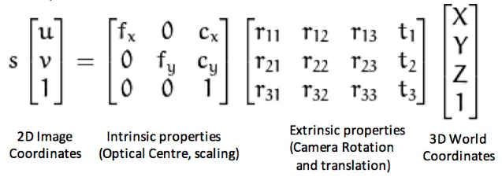

# Multi View Reconstruction

## Tasks
- [ ] Pipeline for Imagery Collection
- [ ] Camera Parameter Estimation
   
   - Method 1: [Automatic Camera Recovery for closed or Open Image Sequences](https://ora.ox.ac.uk/objects/uuid:e533e8d4-d750-4e0d-a9f5-92174013764a/files/sd217qr45g)
   - Method 2: [Self-Calibration and Metric Reconstruction
in spite of Varying and Unknown Intrinsic Camera Parameter](https://people.inf.ethz.ch/~pomarc/pubs/PollefeysIJCV99.pdf)
   - Method 3: SIFT (Scale Invariant Feature Transform)
- [ ] Bundle Adjustment
- [ ] Depthmap Reconstruction(not necessary can use a graph cut based method on voxel grid)
- [ ] Volumentric Fusion
- [ ] Final Rendering

## Problem Framing

We are framing the multi-view reconstruction problem as a **convex energy minimization** problem. The following resources provide key insights into this approach and offer foundational concepts to be implemented:

- [Framing the Multi View Reconstruction problem as a convex energy minimization problem](https://cvg.cit.tum.de/_media/spezial/bib/kolev-et-al-ijcv09.pdf)
- [Multi View Reconstruction from RGB + Depth Data](https://cvg.cit.tum.de/_media/spezial/bib/steinbruecker_etal_iccv2013.pdf)

## Surface Reconstruction Using Voxel Mapping

For surface reconstruction using voxel mapping, we are basing our implementation on ideas presented in the following paper:

- [Surface Reconstruction from 2D images using Voxel Mapping](https://ijoes.vidyapublications.com/paper/Vol24/09-Vol24.pdf)

## Additional References

Though not directly relevant, the following paper provides ideas that may be useful in our case:

- [By Example 3D Reconstruction](https://talhassner.github.io/home/projects/By_Example_Reconstruction/BP06_HASSNER_T.pdf)

## Dependencies

We will be utilizing the `pytorch_volumetric` library to work with voxelized tensors:

- GitHub Repo: [UM-ARM-Lab/pytorch_volumetric](https://github.com/UM-ARM-Lab/pytorch_volumetric)

This library handles voxel tensor operations, significantly reducing the need for custom voxelization code.

## How to Use

1. Clone this repository:
   ```bash
   git clone this repo
   ```
2. Install the necessary dependencies:
   ```bash
   bruh
   ```
